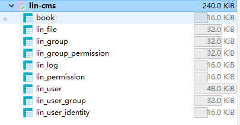
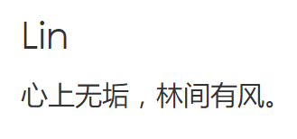
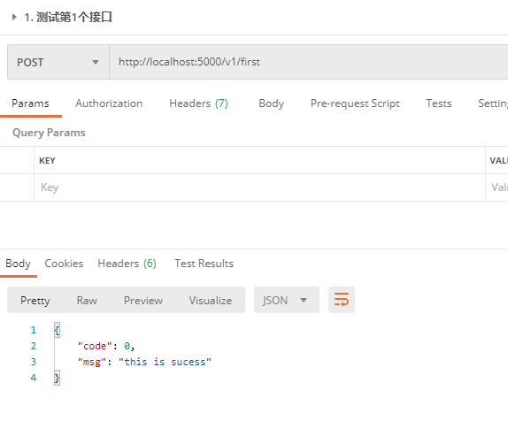

# lin-cms 初步接触

[lin-cms](https://doc.cms.talelin.com/) 是 [林间有风](https://gitee.com/talelin) 维护的一整套后台管理系统

支持koa、vue前后分离

该笔记是记录[慕课网-0到1快速构建自己的后台管理系统](https://www.imooc.com/learn/1247)的笔记

前端用[lin-cms-vue](https://gitee.com/talelin/lin-cms-vue)里面的[imooc-island](https://gitee.com/talelin/lin-cms-vue/tree/imooc-island/)分支

后台用[lin-cms-koa](https://gitee.com/talelin/lin-cms-koa)里面的[imooc-isload](https://gitee.com/talelin/lin-cms-koa/tree/imooc-island/)


## lin-cms-vue启动服务

1. 克隆 imooc-island 这个分支的代码
```shell
git clone -b imooc-island https://gitee.com/talelin/lin-cms-vue
```

2. 切换到taobao源
```shell
# npm源
npm config set registry https://registry.npm.taobao.org/

# node-sass源
npm config set sass_binary_site https://npm.taobao.org/mirrors/node-sass
```

3. 安装依赖
```shell
npm i
```

4. 启动服务
```shell
cd lin-cms-vue # 进入前端的服务

npm run serve # 启动服务
```
最终启动了 `` 服务，浏览器访问即可

点击登录提示 `api调用异常` 那是因为我们后台服务还没启动，按照下面启动后台服务


## lin-cms-koa启动服务
1. 克隆 imooc-island 这个分支的代码
```shell
git clone -b imooc-island https://gitee.com/talelin/lin-cms-koa
```

2. 在mysql里面创建数据库
数据库要和 `/lin-cms-koa/app/config/secure.js` 里面配置的保持一致
```js
module.exports = {
  db: {
    database: 'lin-cms', // 数据库名
    host: 'localhost',
    dialect: 'mysql',
    port: 3306,
    username: 'root',
    password: '123456',
    logging: false,
    timezone: '+08:00'
  }
};
```


3. 导入数据库
在koa根目录有个 `/lin-cms-koa/island.sql` 和 `/lin-cms-koa/schema.sql` sql文件

* `schema.sql` 是 lin-cms的官方sql插件
* `island.sql` 是 这个项目才用到的sql插件


导入到上面创建的数据库里，最终生成下面的数据结构



sql会创建 `root/123456` 的超级管理员账户

4. 启动服务
```shell
cd lin-cms-koa # 进入服务端目录

npm run start:dev # 启动本地服务
```
最终启动了 `http://localhost:5000` 服务



再回到前端的页面，点击登录即可访问成功


## 开发一个最简单的接口
在 `/lin-cms-koa/app/api/v1/firstapi.js` 内容如下:
```js
import { LinRouter } from 'lin-mizar';

const firstApi = new LinRouter({
  prefix: '/v1/first'
});

firstApi.post('/', async ctx => {
  return ctx.json({
    code: 0,
    msg: 'this is sucess'
  });
});

module.exports = { firstApi };
```

开发完后，会自动重启服务，然后用postman测试下接口 `http://localhost:5000/v1/first`

已经可以正常访问




## 后台接口参数校验
lin-cms集成了方便的[接口参数校验器](https://doc.cms.talelin.com/server/koa/validator.html)

新建 `/lin-cms-koa/app/validators/firstapi.js`， 代码见里面


