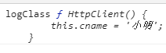

# typescript学习

## 1、 ts的简单入门

#### 1.1 ts的初始化
```
npx tsc --init 
```
就会生成 `tsconfig.json` 并且里面填充了很多配置


#### 1.2 实现泛型接口
如果一个类实现了泛型接口，这么这个类也应该是一个泛型类，泛型由类实例化的时候传递进来。

代码: `db.js`

```js
// 接口DBI，约束所有数据库类要实现的功能
interface DBI<T> {
    add (data: T): boolean; // 增 传递进一个泛型类
    del (id: number): boolean; // 删-根据id删除某条数据
    update(data:T, id:number): boolean; // 更-根据id更新某条数据
    get(id:number): T; // 查-根据id查询某条数据
};

// 定义一个操作Mysql的类，要实现泛型接口则该类也是一个泛型类
class Mysql<T> implements DBI<T> {
    add(data: T): boolean {
        console.log('add', data);
        return true;
    }
    del(id: number): boolean {
        console.log('del', id);
        return true;
    }
    update(data: T, id: number): boolean {
        throw new Error("Method not implemented.");
    }
    get(id: number): T {
        throw new Error("Method not implemented.");
    }
}
```


## 2、 装饰器
装饰器就是一个方法，能够注入到类、方法、属性上扩展类、方法、属性的功能。

常见的装饰器有:
* 类装饰器
* 属性装饰器
* 方法装饰器
* 参数装饰器

装饰器的写法：
- 普通装饰器（无法传参）
- 装饰器工厂（可传参）

### 2.1 简单的demo
先看最简单的装饰器demo: 
```typescript
function logClass<T> (params: T) {
    console.log('logClass', params);
}

@logClass
class HttpClient {
    private cname: string = '小明';

    public run () {
        console.log(this.cname + ' is run');
    }
}
```

因为ts的装饰器还处于试验阶段，如果使用，需要在 `tsconfig.json` 中设置 `experimentalDecorators: true` 以关闭警告

编译后，在浏览器运行，可以发现params参数实际上就是被装饰的类



在装饰器上，我们可以对该类的属性、方法等进行增强

```typescript
function logClass (params: any) {
    console.log('logClass', params);
    params.prototype.age = '23';
    params.prototype.say = function () {
        console.log(this.cname+'今年'+this.age+'岁')
    }
}

@logClass
class HttpClient {
    private cname: string = '小明';

    public run () {
        console.log(this.cname + ' is run');
    }
}

const h: any = new HttpClient();
h.run();
h.say();
```
可以发现，很直接定义好类是一样的。


上面这种其实就是无参装饰器，我们没法在
```typescript
// 没法在下面给装饰器传递参数
@logClass
class HttpClient {
}
```
这里给装饰器传递参数。因此需要装饰器工厂


## 装饰器工厂

在上面例子我们可以参数无法给普通的装饰器传递我们想要的数据。所以需要改造成一个装饰器工厂

装饰器工厂实际上也是一个函数，该函数最终return出来一个函数（这个函数就是上面的普通装饰器函数）

```typescript
function logClass2(api: string) {

    // return的这个函数接收一个target参数，该参数其实就是被装饰的对象
    return function (target: any) {
        console.log('logClass-api', api);
        console.log('logClass-target', target);
    }
}

@logClass2('http://baidu.com/channel_api/')
class HttpClient2 {
    private cname: string = '小明';

    public run () {
        console.log(this.cname + ' is run');
    }
}
```

代码: `/src/desc2.ts`

通过将普通装饰器再包装一层，就可以实现我们自定义传递参数了。


### 2.3 装饰器修改构造函数
上面的例子是用装饰器修改了类的属性、方法。

装饰器还可以修改类的构造函数。类装饰器表达式会在运行时当做函数被调用，类的构造函数作为其唯一的参数。

如果类装饰器返回一个值，它会使用提供的构造函数来替换类的声明

```typescript

function logClass3 (target: any) {
    console.log('logClass3', target);

    // 返回一个类继承target（即下面的HttpClient3）
    // 然后再改类中一定要重写target里面的所有方法、属性
    return class extends target {
        cname = '我是修改后的cname';
        run () {
            console.log(this.cname + '修改后的run');
        }
    }
}

@logClass3
class HttpClient3 {
    cname: string | undefined;
    constructor (cname: string) {
        this.cname = cname;
    }
    run () {
        console.log(this.cname + '正在跑步');
    }
}

const h3 = new HttpClient3('就算传递进去也没有用的');
h3.run(); // 我是修改后的cname修改后的run
```


### 2.4 属性装饰器
装饰器除了用在类上，还可以用在属性上。

同样的，属性装饰器也是分为了普通装饰器（无法传递参数）和装饰器工厂（可自定义传参数）

下面是一个普通属性装饰器的demo: 
```typescript
// 参数1 target 类的原型链，即在上面学类装饰器时候的的target.prototype
// 参数2 key 被装饰的属性的名称
function logParams4 (target: any, key: string) {
    console.log('logParams4', target, key);
    target[key] = '写死的cname';
}

class HttpClient4 {
    @logParams4
    cname: string | undefined;
}

const h4 = new HttpClient4();
console.log(h4.cname);  // 写死的cname
```

可以看出，属性装饰器默认会接受2个参数，一个是被装饰属性的类的原型（在上面target==HttpClient4.prototype），一个数被装饰的属性名称

代码位置: `/src/desc4.ts`


同样的，属性装饰器也可以支持装饰器工厂。
```typescript
function logParams5 (defVal: string) {
    return function (target: any, key: string) {
        target[key] = defVal;
    }
}

class HttpClient5 {
    // 通过装饰器设置默认值
    @logParams5('http://baidu.com/api/')
    cname: string | undefined;
}

const h5 = new HttpClient5();
console.log(h5.cname); // http://baidu.com/api/
```

代码位置: `/src/desc5.ts`


### 2.5 方法装饰器

方法装饰器的简单demo

代码位置: `/src/desc6.ts`

```typescript
// 定义一个方法装饰器，把外部传递给run方法的所有参数转为字符串类型再传递给原run方法
function logMethods (api: string) {
    // 接受3个参数
    // 1. 对于静态成员来说是类的构造函数，对于实例成员是类的原型对象
    // 2. 成员的名称
    // 3. 成员的属性描述符，里面有个 .value 字段就是原方法的实现内容
    // 因为被装饰的是一个实例成员，所以这个的target指向HttpClient6.prototype
    return function (target: any, methodName: string, descInfo: any) {
        console.log(api, target, methodName, descInfo);
        target.cname = '小明'; // 修改原来的HttpClient6.prototype属性

        const oldMethodFn = descInfo.value;
        descInfo.value = function (...args: any[]) {
            console.log(args);
            args = args.map(arg => String(arg)); // 把参数都转为字符串类型
            oldMethodFn.apply(this, args);
        }
    }
}

class HttpClient6 {
    @logMethods('http://baidu.com/api/')
    run (...args: any[]) {
        console.log('run-arguments', args);
        console.log('this is run');
    }
}

const h6: any = new HttpClient6();
console.log(h6.cname);
h6.run(123,'abc');
```


2.6 方法参数装饰器
装饰器还可以修饰方法参数
```js
// 修改方法参数
function logParam7 (api: string) {
    // 参数1 对于静态成员来说是类的构造函数，对于实例成员是类的原型对象
    // 参数2 方法的名称 **注意不是参数的名称**
    // 参数3 属性在函数参数列表中的索引，0开头
    return function (target: any, methodName: string, paramIndex: number) {
        console.log(api, target, methodName, paramIndex);
    }
}

class HttpClient7 {
    say (@logParam7('http://baidu.com') cname: string) {
        console.log(cname + ' is run');
    }
}

const h7 = new HttpClient7();
h7.say('xiaoming');
```


### 2.7 各装饰器的执行顺序

不同级别的执行顺序: `属性 -> 方法参数 -> 方法 -> 类`
如果相同级别的，则按照从后往前执行

```js

function descClass1 (target: any) {
    console.log('descClass1')
}

function descClass2 (target: any) {
    console.log('descClass2')
}

function descParam1 (target: any, paramName: string) {
    console.log('descParam1');
}

function descParam2 (target: any, paramName: string) {
    console.log('descParam2');
}

function descMethod1 (target: any, methohName: string) {
    console.log('descMethod1');
}

function descMethod2 (target: any, methohName: string) {
    console.log('descMethod2');
}

function descMethodParam1 (target: any, methohName: string, paramIndex: number) {
    console.log('descMethodParam1');
}
function descMethodParam2 (target: any, methohName: string, paramIndex: number) {
    console.log('descMethodParam2');
}

@descClass1
@descClass2
class HttpClient8 {
    @descParam1
    @descParam2
    cname: string | undefined;

    @descMethod1
    @descMethod2
    say ( 
        @descMethodParam1 
        @descMethodParam2 
        cname: string ) {

    }
}
```

结果:
```js
// 属性
descParam2
descParam1
// 方法参数
descMethodParam2
descMethodParam1
// 方法
descMethod2
descMethod1
// 类
descClass2
descClass1
```


代码: `/src/desc8.ts`