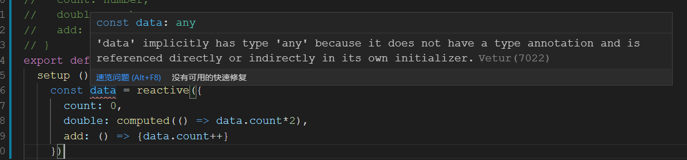
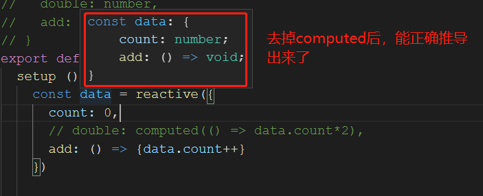
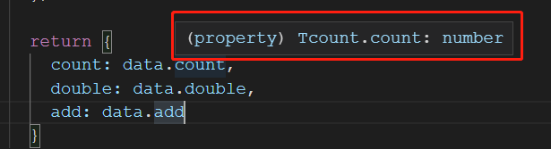
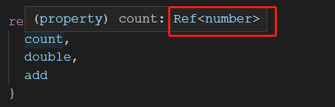
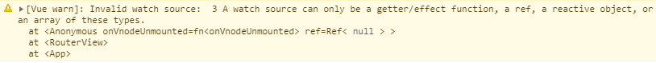

# vue3.0-基础操作

## 和vue2.0的代码的对比
点击按钮，累加器count累加1，然后还有个变量double是count的双倍

在vue2.0的时候，代码如下:
```js
export default {
  data () {
    return {
      count: 0
    };
  },
  computed: {
    double () {
      return this.count * 2;
    }
  },
  method: {
    add () {
      this.count++;
    }
  }
};
```

到了vue3.0

- 提供了setup生命周期，意为“准备阶段”。**在该周期里vue实例还没创建，所以无法通过this访问到实例。** 要把在页面上展示的数据和事件，在setup上最后要return出去 
- 提供了ref来实现相应，想要一个变量是相应的，只需要用ref包裹下
- 提供了computed函数，来实现上面的计算数据
- 由于没有实例，所以无法通过`this.xxx`访问对象。同时，改变数据得通过`xxx.value`去改变才会触发相应
变成下面的代码
```js
import { ref,computed } from 'vue';
export default {
  setup () {
    const count = ref(0);
    const double = computed(() => count.value * 2);

    const add = () => {
      count.value++;
    };

    return {
      count,
      double,
      add
    }
  }
};
```

再继续演变

- 上面代码中，count和double太分散了，我们可以用reactive函数来包裹整个数据。然后改变数据的时候，不需要通过`xxx.value`去改变了，而是通过`data.xxx`去改变
```js
setup () {
    const data = reactive({
      count: 0,
      double: computed(() => data.count*2),
      add: () => {data.count++}
    })
}
```
在vue3中，reactive和computed一起使用的时候，有个缺陷，reactive会返回一个any类型，这个时候ts编译器会提示下面
```
'data' implicitly has type 'any' because it does not have a type annotation and is referenced directly or indirectly in its own initializer.
```


这个是用了computed后，ts推导reactive出现问题，然后给了data个any类型。

如果不用computed的话，ts倒是可以正确的推导出data的类型，如下注释掉computed的代码后，data的类型



解决这个有2种方法，一种是将data显性声明为any类型，这种失去了ts的意义
```js
setup () {
    const data: any = reactive({
        count: 0,
        double: computed(() => data.count*2),
        add: () => {data.count++}
    })
}
```
另外一种是为data声明一个interface，这样就可以让ts正确的推导
```js
interface Tcount {
    count: number,
    double: number,
    add: () => void
}

const data: Tcount = reactive({
    count: 0,
    double: computed(() => data.count*2),
    add: () => {data.count++}
})
```
推荐使用第2种

这样完整的代码就如下:
```vue
<template>
  <h1>{{data.count}}</h1>
  <p>{{data.double}}</p>
  <button @click="data.add">add</button>
</template>

<script lang="ts">
import { reactive, computed } from 'vue';
interface Tcount {
  count: number;
  double: number;
  add: () => void;
}
export default {
  setup () {
    const data: Tcount = reactive({
      count: 0,
      double: computed(() => data.count*2),
      add: () => {data.count++}
    })

    return {
      data
    }
  }
};
</script>
```
上面看出，在html中，我们每个数据、方法，都需要加上`data.xxx`。

那是因为在return的时候，我们return了一个`{data: data}`。所以自然html中每个地方都需要加上data。

为了优化，我们在return的时候改为`{...data}`，让数据直接return出去
```js
return {
    ...data
}
```
这个时候，发现数据可以正常渲染到页面上，但是点击按钮没有反应了，事件能够执行，但数据失去了响应式。

把es6的扩展改为普通的es5形式
```js
return {
    count: data.count,
    double: data.double,
    add: data.add
}
```
借助vscode查看类型发现，`data.count`这些变成了普通了number类型。



而在之前，我们在ref中是可以明确知道，能响应的应该是`Ref<T>`类型



这也解释了为什么点击按钮不发生改变了，只有响应式的数据才会发生响应，我们把响应式数据中对象中取出来（即通过`data.xxx`）得到是普通类型的数据。

为了解决这个问题，vue3推出了 `toRefs()` 函数，在return出去之前，再用toRefs包装下data数据，就可以了。最终代码如下
```js
import { reactive, computed, toRefs } from 'vue';
interface Tcount {
  count: number;
  double: number;
  add: () => void;
}
export default {
  setup () {
    const data: Tcount = reactive({
      count: 0,
      double: computed(() => data.count*2),
      add: () => { console.log('add');data.count++}
    });
    const refData = toRefs(data); // 这里再包裹一下

    return {
      ...refData
    }
  }
};
```

> 这种问题的大致现象可以通过下面方式解释下:
在js中，我们定义了一个对象如下
```js
var person = { name:'xiaoming' };
var teacher = person;
person.name = 'xiaohong'; // 因为是引用，所以2个对象都改为xiaohong

var {name} = person;
name = '小哥'; // 脱离了引用赋值，所以这里的改变不会影响到原对象里面
```


## vue3的生命周期
从vue2迁到vue3的有: 
* `beforeCreate()` --> `use setup()`
* `created` --> `use setup()`
* `beforeMount` --> `onBeforeMount`
* `mounted` --> `onMounted`
* `beforeUpdate` --> `onBeforeUpdate`
* `updated` --> `onUpdated`
* `beforeDestory` --> `onBeforeUnmount`
* `destroyed` --> `onUnmounted`
* `activated` --> `onActivated`
* `deactivated` --> `onDeactivated`
* `errorCaptured` --> `onErrorCaptured`

vue3新增的有:
* `onRenderTracked`: 调试用的构造函数，参数event，有新旧值的变化
* `onRenderTriggered`: 调试用的构造函数，参数event，有事件的详细情况

```js
setup() {
  onBeforeMount(() => {
    console.log('About-onBeforeMount');
  });
  onMounted(() => {
    console.log('About-onMounted');
  });
  onBeforeUpdate(() => {
    console.log('About-onBeforeUpdate');
  });
  onUpdated(() => {
    console.log('About-onUpdated');
  });
  onBeforeUnmount(() => {
    console.log('About-onBeforeUnmount');
  });
  onUnmounted(() => {
    console.log('About-onUnmounted');
  });
  onRenderTracked((event) => {
    console.log('onRenderTracked', event);
  });
  onRenderTriggered(() => {
    console.log('onRenderTriggered', event);
  });
}
```


## watch监听
详情看`Watch.vue`

监听一个响应式:
```js
watch(xxxx, (newVal, oldVal) => {
  console.log('newVal', newVal);
  console.log('oldVal', oldVal);
})
```
监听必须是一个`/有返回值的函数/ref对象/响应式reactive对象/数组`，否则会提示
```
A watch source can only be a getter/effect function, a ref, a reactive object, or an array of these types. 
```


```js
// 监听一个ref对象
const greeting = ref('');
watch(greeting, (newVal, oldVal) => {
  console.log(newVal, oldVal);
});

// 监听一个reactive对象
const data = reactive({
  count: 0
});
watch(data, (newVal, oldVal) => {
  console.log(newVal, oldVal); // 这里返回的是一整个Proxy对象
});

// 监听一个函数的返回值
watch(() => data.count, (newVal, oldVal) => {
  console.log(newVal, oldVal);
});

// 监听数组
watch([()=>data.count, greeting], (newVal, oldVal) => {
  console.log(newVal, oldVal); // 返回一个数组，每个元素和监听的数组格式一样
});
```


