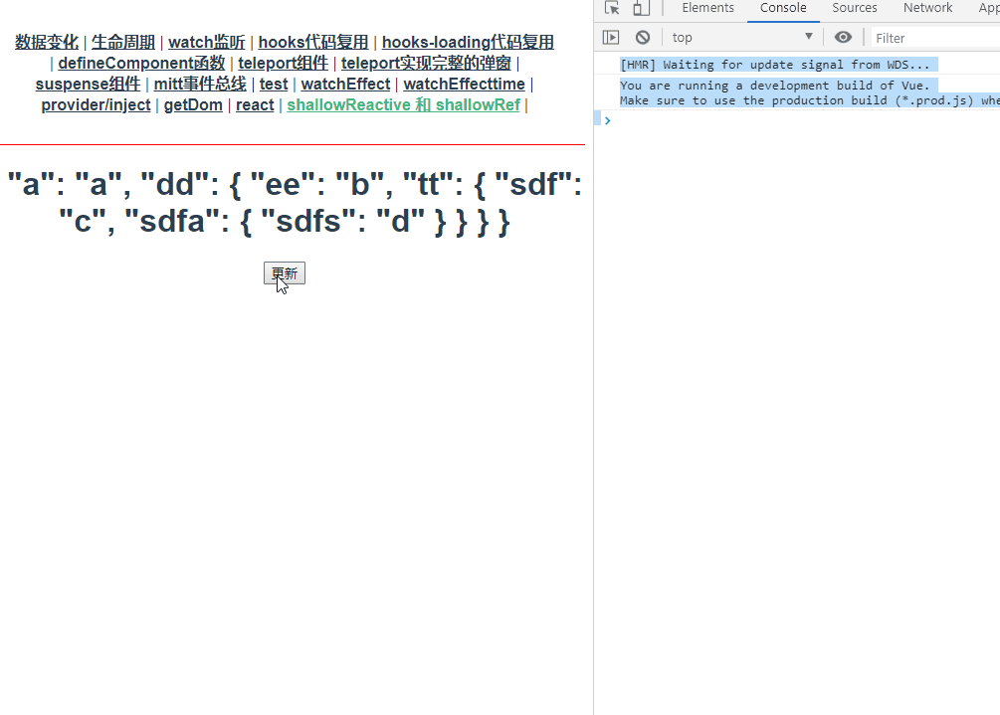
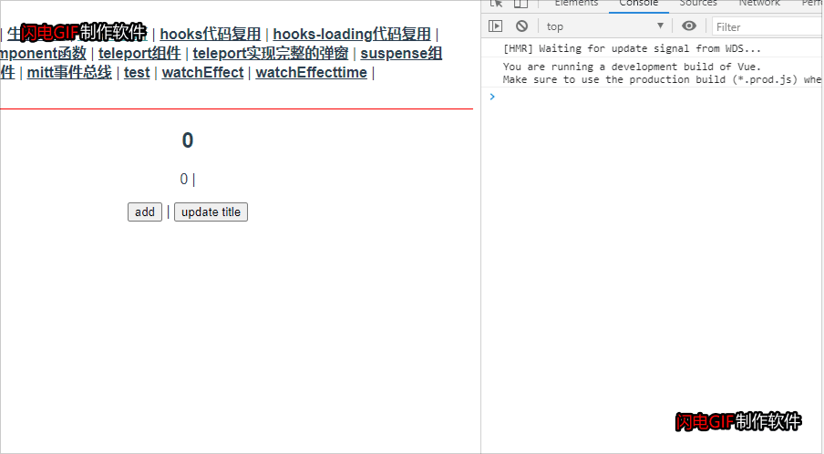
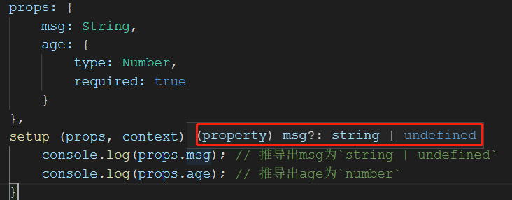
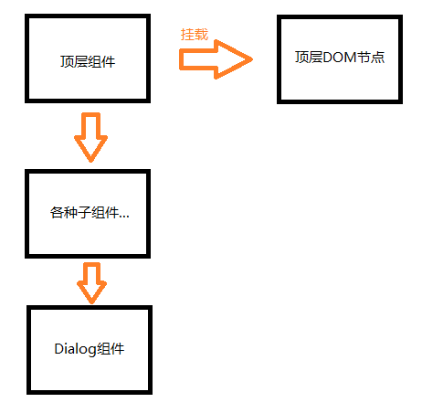
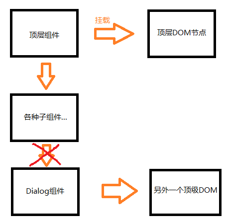

# vue3.0-基础操作

## 1、和vue2.0的代码的对比

### 1.1 最简单的demo
点击按钮，累加器count累加1，然后还有个变量double是count的双倍

在vue2.0的时候，代码如下:
```js
export default {
    data () {
        return {
            count: 0
        };
    },
    computed: {
        double () {
            return this.count * 2;
        }
    },
    method: {
        add () {
            this.count++;
        }
    }
};
```

到了vue3.0

- 提供了setup生命周期，意为“准备阶段”。**在该周期里vue实例还没创建，所以无法通过this访问到实例。** 要把在页面上展示的数据和事件，在setup上最后要return出去 
- 提供了ref来实现响应式数据，想要一个变量是相应的，只需要用ref包裹下
- 提供了computed函数，来实现上面的计算数据
- 由于没有实例，所以无法通过`this.xxx`访问对象。同时，改变数据得通过`xxx.value`去改变才会触发相应

变成下面的代码
```js
import { ref,computed } from 'vue';
export default {
    setup () {
        const count = ref(0);
        const double = computed(() => count.value * 2);

        const add = () => {
            count.value++;
        };

        return {
            count,
            double,
            add
        }
    }
};
```

再继续演变

上面代码中，count和double太分散了，我们可以用reactive函数来包裹整个数据。然后改变数据的时候，不需要通过`xxx.value`去改变了，而是通过`data.xxx`去改变
```js
setup () {
    const data = reactive({
        count: 0,
        double: computed(() => data.count*2),
        add: () => {data.count++}
    })
}
```

判断一个变量是不是ref，用`isRef`
```js
setup () {
    const name = ref('');
    console.log(isRef(name)); // true

    const formData = reactive({
        age: 0,
        name: '小明'
    });
    console.log(isRef(formData)); // false
    console.log(isRef(formData.name)); // false

    const refData = toRefs(formData);
    console.log(isRef(refData)); // false
    console.log(isRef(refData.age)); // true
;}
```

setup 函数不能是异步函数，即不能用async修饰，否则会出现空白页面
```js
// 不能写下面的写法
async setup () {}
```


### 1.2 reactive和computed一起使用变成any类型
在vue3中，reactive和computed一起使用的时候，有个缺陷，reactive会返回一个any类型，这个时候ts编译器会提示下面
```
'data' implicitly has type 'any' because it does not have a type annotation and is referenced directly or indirectly in its own initializer.
```


这个是用了computed后，ts推导reactive出现问题，然后给了data个any类型。

如果不用computed的话，ts倒是可以正确的推导出data的类型，如下注释掉computed的代码后，data的类型


解决这个有2种方法，一种是将data显性声明为any类型，这种失去了ts的意义
```js
setup () {
    const data: any = reactive({
        count: 0,
        double: computed(() => data.count*2),
        add: () => {data.count++}
    })
}
```
另外一种是为data声明一个interface，这样就可以让ts正确的推导
```js
interface Tcount {
    count: number,
    double: number,
    add: () => void
}

const data: Tcount = reactive({
    count: 0,
    double: computed(() => data.count*2),
    add: () => {data.count++}
})
```
推荐使用第2种

这样完整的代码就如下:
```vue
<template>
<h1>{{data.count}}</h1>
<p>{{data.double}}</p>
<button @click="data.add">add</button>
</template>

<script lang="ts">
import { reactive, computed } from 'vue';
interface Tcount {
    count: number;
    double: number;
    add: () => void;
}
export default {
    setup () {
        const data: Tcount = reactive({
            count: 0,
            double: computed(() => data.count*2),
            add: () => {data.count++}
        })

        return { data }
    }
};
</script>
```
上面看出，在html中，我们每个数据、方法，都需要加上`data.xxx`。

那是因为在return的时候，我们return了一个`{data: data}`。所以自然html中每个地方都需要加上data。

为了优化，我们在return的时候改为`{...data}`，让数据直接return出去
```js
return {
    ...data
}
```
这个时候，发现数据可以正常渲染到页面上，但是点击按钮没有反应了，事件能够执行，但数据失去了响应式。

把es6的扩展改为普通的es5形式
```js
return {
    count: data.count,
    double: data.double,
    add: data.add
}
```
借助vscode查看类型发现，`data.count`这些变成了普通了number类型。


而在之前，我们在ref中是可以明确知道，能响应的应该是`Ref<T>`类型


这也解释了为什么点击按钮不发生改变了，只有响应式的数据才会发生响应，我们把响应式数据中对象中取出来（即通过`data.xxx`）得到是普通类型的数据。

为了解决这个问题，vue3推出了 `toRefs()` 函数，在return出去之前，再用toRefs包装下data数据，就可以了。

`toRefs`是将对象里面数据都转为ref对象

最终代码如下
```js
import { reactive, computed, toRefs } from 'vue';
interface Tcount {
    count: number;
    double: number;
    add: () => void;
}
export default {
    setup () {
        const data: Tcount = reactive({
            count: 0,
            double: computed(() => data.count*2),
            add: () => { console.log('add');data.count++}
        });
        const refData = toRefs(data); // 这里再包裹一下

        return {
            ...refData
        }
    }
};
```

有时候，只是想要去某个值，就可以用下面的写法解构
```js
export default {
    setup () {
        const data: Tcount = reactive({
            count: 0,
            double: computed(() => data.count*2),
            add: () => { console.log('add');data.count++}
        });
        const {count} = toRefs(data); // 解构赋值

        return {
            count
        }
    }
};
```

有时候，我们不想要把data里面的属性都转为响应式。

比如其他的属性只是在js内部使用，不需要和页面响应式。

那么在 `toRefs()` 传递第2个参数可以控制转化的范围
```js
const count = toRefs(data, 'count'); // 仅仅将count转为，其他的不会转化
```


> 这种问题的大致现象可以通过下面方式解释下:
在js中，我们定义了一个对象如下
```js
var person = { name:'xiaoming' };
var teacher = person;
person.name = 'xiaohong'; // 因为是引用，所以2个对象都改为xiaohong

var {name} = person;
name = '小哥'; // 脱离了引用赋值，所以这里的改变不会影响到原对象里面
```

### 1.3 声明只能取值某些范围
当我们想要限定变量的取值范围在我们指定的几个值里面，可以给ref传递一个泛型
```js
type UploadStatus = 'ready' | 'loading' | 'sucess' | 'error';

setup () {
    const fileStatus = ref<UploadStatus>('ready');
    fileStatus.value = '234sdf'; // 不能，不在声明的范围内
    fileStatus.value = 'loading'; // 可以
}
```

### 1.4 reactive和ref
ref用来声明简单类型的响应式，reactive用来声明数组、对象的响应式

ref底层是调用reactive，比如 `const count = ref(1)` 在底层是这么调用reactive `const count = reactive({value:1})`

这也解释了为什么我们改变ref的值的时候，要通过`count.value`去改变

判断一个变量是不是ref，vue提供了 `isRef()` 。

判断一个变量是不是reactive，vue提供了 `isReactive()`


### 1.5 递归监听和非递归监听
代码: `/src/views/shallowReactive.vue`

首先理解什么是递归监听，我们用reactive或ref声明数据的时候，其实是一个递归监听。

比如下面代码:
```js
setup () {
    const person = reactive({
        a: 'a',
        dd: {
            ee: 'b',
            tt: {
                sdf: 'c',
                sdfa: {
                    sdfs: 'd'
                }
            }
        }
    });

    const update = () => {
        console.log(person); // Proxy{}
        console.log(person.dd); // Proxy{}
        console.log(person.dd.tt); // Proxy{}
        console.log(person.dd.tt.sdfa); // Proxy{}

        person.a = '1';
        person.dd.ee = '2';
        person.dd.tt.sdf = '3';
        person.dd.tt.sdfa.sdfs = '4';

        console.log(JSON.stringify(person));
    };
    return {person, update};
}
```
通过 `console.log` 可以看出，不论层级多深，vue都会递归出来并且将其声明加上proxy监听。

在 ref 中也是如此
```js
const person = ref({
    a: 'a',
    dd: {
        ee: 'b',
        tt: {
            sdf: 'c',
            sdfa: {
                sdfs: 'd'
            }
        }
    }
});
const update = () => {
    console.log(person.value); // proxy{}
    console.log(person.value.dd); // proxy{}
    console.log(person.value.dd.tt); // proxy{}
    console.log(person.value.dd.tt.sdfa); // proxy{}
    person.value.a = '1';
    person.value.dd.ee = '2';
    person.value.dd.tt.sdf = '3';
    person.value.dd.tt.sdfa.sdfs = '4';
    console.log(JSON.stringify(person));
};
```

vue@3 提供了 `shallowReactive/shallowRef` 来实现非递归监听，只会监听第1层
```js
const person = shallowReactive({
    a: 'a',
    dd: {
        ee: 'b',
        tt: {
            sdf: 'c',
            sdfa: {
                sdfs: 'd'
            }
        }
    }
});
const update = () => {
    console.log(person); // proxy{}
    console.log(person.dd); // {}
    console.log(person.dd.tt); // {}
    console.log(person.dd.tt.sdfa); // {}
    person.a = '1';
    person.dd.ee = '2';
    person.dd.tt.sdf = '3';
    person.dd.tt.sdfa.sdfs = '4';
    console.log(JSON.stringify(person));
};
```
从 `console.log` 的结果看出，只有 person 是proxy类型，其他的都是普通的对象类型。

当我们点击按钮触发update的时候，可以看到界面所有的数据跟着改了，但这不能说明所有数据都是proxy响应式的



出现数据更新是因为我们的第1层是proxy响应式，即 `{a: 'a'}` 这一层才是响应式。

而我们执行了代码`person.a='1'`，会触发响应更新视图，在更新DOM之前，后面的代码已经对数据造成了影响，所以这个时候更新上去的数据，看上去好像所有数据都有发生响应

如果我们把`person.a='1'`去掉，就会发生，即使我们执行了update，视图也不会跟着改变

而相同的代码，换成 shallowRef 效果如下: 
```js
const person = shallowRef({
    a: 'a',
    dd: {
        ee: 'b',
        tt: {
            sdf: 'c',
            sdfa: {
                sdfs: 'd'
            }
        }
    }
});
const update = () => {
    console.log(person.value); // {}
    console.log(person.value.dd); // {}
    console.log(person.value.dd.tt); // {}
    console.log(person.value.dd.tt.sdfa); // {}
    person.value.a = '1';
    person.value.dd.ee = '2';
    person.value.dd.tt.sdf = '3';
    person.value.dd.tt.sdfa.sdfs = '4';
    console.log(JSON.stringify(person));
};
return {person, update};
```
通过console 我们看出无论哪一层，都是普通的对象而不是proxy对象，这是为什么呢？

前面已经讲过 ref 底层会用 `reactive({value: xxx})` 那么套在这里就能理解了，其实第1层是 `{value:xx}`。

可以这么理解，通过 `shallowRef` 创建数据，那么vue监听的是 `.value` 的变化，并不是第1层

假如我们改成下面写法
```js
const update = () => {
    // 改变value的地址了
    person.value = {
        a: '1',
        dd: {
            ee: '2',
            tt: {
                sdf: '3',
                sdfa: {
                    sdfs: '4'
                }
            }
        }
    };
};
```
那么就会触发更新DOM

如果我们真的不想通过改变value内存地址去更新DOM，vue还提供了另外一个 `triggerRef` 让我们可以手动触发更新DOM
```js
const update = () => {
    person.value.a = '1';
    person.value.dd.ee = '2';
    person.value.dd.tt.sdf = '3';
    person.value.dd.tt.sdfa.sdfs = '4';
    triggerRef(person); // 在做完上面一系列操作后，手动调用 triggerRef ，vue就会触发更新DOM
};
```

> 需要注意的是，vue提供了 triggerRef 和 shallowRef 搭配使用，但是对于shallowReactive并没有提供类似的triggerReactive


## vue3的生命周期
从vue2迁到vue3的有: 
* `beforeCreate()` --> `use setup()`
* `created` --> `use setup()`
* `beforeMount` --> `onBeforeMount`
* `mounted` --> `onMounted`
* `beforeUpdate` --> `onBeforeUpdate`
* `updated` --> `onUpdated`
* `beforeDestory` --> `onBeforeUnmount`
* `destroyed` --> `onUnmounted`
* `activated` --> `onActivated`
* `deactivated` --> `onDeactivated`
* `errorCaptured` --> `onErrorCaptured`

vue3新增的有:
* `onRenderTracked`: 调试用的构造函数，参数event，有新旧值的变化
* `onRenderTriggered`: 调试用的构造函数，参数event，有事件的详细情况

```js
setup() {
    onBeforeMount(() => {
        console.log('About-onBeforeMount');
    });
    onMounted(() => {
        console.log('About-onMounted');
    });
    onBeforeUpdate(() => {
        console.log('About-onBeforeUpdate');
    });
    onUpdated(() => {
        console.log('About-onUpdated');
    });
    onBeforeUnmount(() => {
        console.log('About-onBeforeUnmount');
    });
    onUnmounted(() => {
        console.log('About-onUnmounted');
    });
    onRenderTracked((event) => {
        console.log('onRenderTracked', event);
    });
    onRenderTriggered((event) => {
        console.log('onRenderTriggered', event);
    });
}
```


## watch监听
详情看 `Watch.vue`

监听一个响应式:
```js
watch(xxxx, (newVal, oldVal) => {
    console.log('newVal', newVal);
    console.log('oldVal', oldVal);
})
```
监听必须是一个 `/有返回值的函数/ref对象/响应式reactive对象/数组` ，否则会提示
```
A watch source can only be a getter/effect function, a ref, a reactive object, or an array of these types. 
```


```js
// 监听一个ref对象
const greeting = ref('');
watch(greeting, (newVal, oldVal) => {
    console.log(newVal, oldVal);
});

// 监听一个reactive对象
const data = reactive({
    count: 0
});
watch(data, (newVal, oldVal) => {
    console.log(newVal, oldVal); // 这里返回的是一整个Proxy对象
});

// 监听一个函数的返回值
watch(() => data.count, (newVal, oldVal) => {
    console.log(newVal, oldVal);
});

// 监听数组
watch([()=>data.count, greeting], (newVal, oldVal) => {
    console.log(newVal, oldVal); // 返回一个数组，每个元素和监听的数组格式一样
});
```

`watch(xxx, (newVal, oldVal, clean) => {})` 第3个参数`clean`的作用，会从第2次watch触发开始每次执行watch之前触发
```js
watch(() => data.count, (newVal, oldVal, clean) => {
    console.log('newVal', newVal, oldVal);
    clean(() => { // 第一次触发watch并不会执行，到了第2次就会最先执行，我们常常用来处理异步情况
        console.log('clean');
    });
})
```



## watchEffect()
在程序中，我们的数据发生改变，视图就要跟着发生变化，我们称这种行为叫做副作用，vue@3中提供了 `wacthEffect()` 来监听这种副作用
```js
const count = ref(0);
const num = ref(1);

// 在watchEffect里面用到了哪些响应式数据，就会监听哪一些
// 比如下面的watchEffect里面只有 num这个响应式数据，所以num改变就会触发
// 而 count 并不在里面，所以count改变了也不会触发
watchEffect(() => {
    console.log(num.value); 
});
```
不同于watch， watchEffect在组件初始化的时候就会调用一次，可以理解为一进入页面就会调一次。而watch是首次数据不会调用，数据发生改变之后才会调


`watchEffect()` 返回一个函数，调用函数则会取消掉监听（仅仅取消监听而已），也会还是会继续相应
```js
const num = ref(1);
const change = () => {
    num.value++;
    // 当num=5的时候，执行了stop，则取消监听
    if (num.value === 5) {
        stop();
    }
};
const stop = watchEffect(() => {
    console.log('watchEffect', num.value);
});
```


### 清除副作用
清除副作用主要是在异步函数中进行使用的，因为有的时候，我们需要在异步函数触发之前，就会进行一些副作用的功能。

比如输入框，用户每次输完后，我们实时请求后台数据，我们其实没有必要每次输入都发起ajax请求，我们只需要在最后一次发起就可以了，前面的ajax是可以取消的。

```js
const keyword = ref('');
var cacenlToken = null;

watchEffect(async(cancel) => {
    const resp = await axios.get('/api', {
        params: {keyword: keyword.value},
        cancelToken: new axios.CancelToken((c) => {
            cacenlToken = c;
        })
    });

    // 就算放在后面，也是比await先触发
    cancel(() => {
        cacenlToken(); // 取消ajax的请求
    });
})
```

### 副作用刷新时机
首先要了解副作用是什么时候触发的。
```js
const count = ref(0);
const update = () => {
    count.value++;
};
onBeforeMount(() => {
    console.log('onBeforeMount')
})
onMounted(() => {
    console.log('onMounted')
})
watchEffect(() => {
    console.log('count', count.value);
});
```
首次进入页面的时候，上面的执行顺序是 `watchEffect -> onBeforeMount -> onMounted`

如果我们想要让 watchEffect 在组件挂载后执行，可以把watchEffect放在onMounted里面，这样子我们才可以在 watchEffect 里面拿到DOM和ref对象
```js
onBeforeMount(() => {
    console.log('onBeforeMount')
});
onMounted(() => {
    watchEffect(() => {
        console.log('wactchEffect' , document.getElementById('box'));
    });
    console.log('onMounted')
})
```
> 上面的虽然在watchEffect里面拿到DOM了，但是执行顺序是`onBeforeMount -> wactchEffect -> onMounted`

之后数据发生改变，会触发watchEffect，此时watchEffect触发时机是在DOM已经完成新的渲染之后
```js
<div id="box">{{count}}</div>

watchEffect(() => {
    console.log(document.getElementById('box').innerHTML); // 可以看出，每次改变count并且DOM数据已经更新了之后，才触发wacthEffect
});
```

如果我们想要改变这个时机，可以通过第2个参数
```js
watchEffect(() => {
    console.log(document.getElementById('box').innerHTML);
}, { flush: 'pre' }); // pre 表示在DOM发生渲染前触发，获取的的DOM是渲染前的

watchEffect(() => {
    console.log(document.getElementById('box').innerHTML);
}, { flush: 'sync' });  // sync 表示和DOM渲染同步进行，即发生渲染的那一刻触发，经过实验，获取的DOM也是旧的
```


## 代码复用hooks
代码: `Hooks.vue`

在vue2中，组件代码的复用主要是依赖mixins实现

而在vue3中，组件代码的复用则主要使用hooks函数

比如这么个场景，进入页面后，监听下用户的点击，页面展示用户点击的 `x坐标/y坐标`

在vue3代码如下:
```js
setup() {
    const x = ref(0);
    const y = ref(0);
    const updateMouse = (ev: MouseEvent) => {
        x.value = ev.pageX;
        y.value = ev.pageY;
    };
    onMounted(() => { // 开始监听
        document.addEventListener('click', updateMouse);
    });
    onUnmounted(() => { // 取消监听
        document.removeEventListener('click', updateMouse);
    });

    return { x, y };
},
```
点击获取 `x坐标/y坐标` 这块逻辑是可以复用的，我们封装起来以后方便其他组件使用。

1. 在 `/src/hooks/useMousePosition.ts`。

我们习惯hooks文件名以 `useXXX.tx` 开头。

把上面的逻辑复制过去，内容如下:
```js
import { ref, onMounted, onUnmounted } from 'vue';
function useMousePosition () {
    const x = ref(0);
    const y = ref(0);
    const updateMouse = (ev: MouseEvent) => {
        x.value = ev.pageX;
        y.value = ev.pageY;
    };
    onMounted(() => { // 开始监听
        document.addEventListener('click', updateMouse);
    });
    onUnmounted(() => { // 取消监听
        document.removeEventListener('click', updateMouse);
    });
    return {x, y}; // 最后要return出去
}

export default useMousePosition;
```

2. 在页面上引入上面的hooks后，调用下获取到Ref类型的坐标
```js
setup() {
    const {x, y} = useMousePosition();
    return { x, y };
}
```
这种方式比mixins好很多，看出 `{x, y}` 是从哪里来的。


### 代码复用hooks
使用hooks封装一个场景，axios请求接口，请求前展示loading文字，请求后展示后台的数据

代码: `HooksLoading.vue`
```js
function useURLLoader (api: string) {
    const isLoading = ref(true);
    const isLoaded = ref(false);
    const result = ref(null);
    const error = ref(null);

    axios.post(api).then((rowData) => {
        isLoading.value = false;
        isLoaded.value = true;
        console.log(rowData.data)
        result.value = rowData.data;
    }).catch(err => {
        isLoading.value = false;
        isLoaded.value = true;
        error.value = err;
    });
    // 有响应式的，所以可以不用放在回调里面
    return { isLoading, isLoaded, result, error };
}

export default useURLLoader;
```


## defineComponent
defineComponent函数是为了ts而生，加上后可以给ts识别，能语法提示

比如加上后，能自动推导出prop的类型

代码: `DefineComponent.vue`

```js
export default defineComponent({
    props: {
        msg: String,
        age: {
            type: Number,
            required: true
        }
    },
    setup (props, context) {
        console.log(props.msg); // 推导出msg为`string | undefined`
        console.log(props.age); // 推导出age为`number`
    }
})
```
在vscode中，鼠标移动到 `props.msg` 上会自动提示msg的类型



`context`是一个对象，里面提供了3个属性给我们使用
- `context.attrs`
- `context.slots`
- `context.emit`


## Teleport
意为“瞬移”。

代码: `Teleport.vue`

有这么个场景，在页面上要展示一个全局遮罩对话框让用户选择，那么就可能这么设计组件
```html
<div class="page">
    <div class="com"></div>
    <Dialog v-if="isShow"></Dialog>
</div>
```
这种会造成这么个问题，渲染最终`<Dialog></Dialog>`会嵌套在页面组件内部，形成了父子结构，但是页面顶层组件是挂载在顶层DOM节点上的，`<Dialog>`变得非常深。

这就比较尴尬，从用户感知来说，`<Dialog>`组件应该是一个比较独立的组件。



Teleport就是为了解决这种情况

使用Teleport后，我们可以把组件挂载到指定的DOM上，而不必一定准守写代码时候组件的顺序



在封装`myDialog.vue`的时候，代码如下
```html
<!-- 表示渲染的时候，要挂载到id=modal的DOM上 -->
<teleport to="#modal">
    <div>
        myDialog
    </div>
</teleport>
```

如果是封装自己第3方组件，我们提供给外面的人用，不能让人家每次都去修改index.html模板，所以我们可以在自己的loading等组件内。手动创建这个dom
```
setup () {
    const node = document.createElement('div');
    node.id = 'modal';
    document.body.appendChild(node);

    onUnmounted(() => {
        document.body.removeChild(node);
    });
}   
```


## emits
代码: `ModelDemo.vue` 里面引用的 `myFullDialog.vue`

在vue3中，有个新属性emits，用来校验我们将要广播出去的emit是否符合我们要求，符合才会真正的emit出去

如果不想要校验，一个是可以不写，另外是可以设置为null

```js
emits: {
    close: (playload: any) => {
        return playload.type === 'close';
    }
}
```
也可以用数组
```js
emits: ['form-submit']
```
加了`emits`属性后，组件内想要通过emit广播出去的事件，都必须在限定的范围内才可以


## Suspense
代码: `SuspensePromise.vue`

在js中，有很多异步操作，比如ajax请求，有这么个场景，在ajax请求的过程中，展示loading，请求完后展示后台的数据。在以前我们通过组件切换来实现。

而在vue3中，提供了 `<Suspense />` 给我们实现这种异步操作的场景。**如果使用Suspense。在setup中应该返回一个promise而不是一个对象**
```html
<Suspense>
    <template #default>
        <div>
            <sync-show></sync-show>
            <fetch-show></fetch-show>
        </div>
    </template>
    <template #fallback>
        loading....
    </template>
</Suspense>
```
- `#defaultdefault`: 请求成功后的界面
- `#fallback`: 请求成功前的界面
- `<Suspense />`: 会等到所有的promise成功后才展示内容

如果想要监听异常，则可以使用 `onErrorCaptured` 钩子函数
```js
onErrorCaptured(ev => {
    errInfo.value = ev;
    return true; // 表示向上传递
});
```


## 插件开发
在vue@2中，我们通过`provider/inject`跨级组件通讯，在vue@3中也有类似的功能。兄弟组件就无法通过这种方式共享数据，因为代码无法确定执行inject的时候，已经执行过provider

我们将要跨级通讯的数据存到provider，然后通过inject获取

```js
// 中间件js
// 代码: /src/js/useCross.ts
import { provide, inject, Ref } from 'vue';

const StoreSymbol = Symbol(); // 生成唯一的key

// 给祖先级用的，传入想要共享的数据
export function providerStore(count: Ref<number>) {
    provide(StoreSymbol, count);
}

// 给后代组件用的，返回共享的数据
export function useStore(): Ref<number> | undefined {
    const count = inject<Ref<number>>(StoreSymbol);
    return count;
}
```
然后在祖先元素就可以通过provide传入数据
```vue
<template>
    <div>
        <p>{{count}}</p>
        <button @click="update">更新</button>
        
        <child></child>
    </div>
</template>

<script>
import { defineComponent, ref } from 'vue';
import { providerStore } from '@/js/useCross';
import Child from '@/components/Child.vue';
export default defineComponent({
    components: { Child },
    setup () {
        const count = ref(1);
        const update = () => {
            count.value++;
        };
        providerStore(count);

        return {count, update};
    }
});
</script>
```
然后再后背组件获取
```vue
<template>
    <div>child: {{num}}</div>
</template>

<script>
import { defineComponent, watchEffect } from 'vue';
import { useStore } from '@/js/useCross';
export default defineComponent({
    setup () {
        const num = useStore();
        watchEffect(() => {
            console.log('this is child', num.value);
        });

        return { num };
    }
})
</script>
```


## 去掉了事件总线
在 vue@2 中，我们经常用 `const eventBus = new Vue()` 事件总线来跨组件通讯。

在 vue@3 中，去掉了这个特性，官方推荐使用[mitt](https://www.npmjs.com/package/mitt)

用法和 vue@2 的时候差不多

代码位置: `/src/views/Mitt.vue`


## 全局api的修改
在vue2中，创建vue的代码经常如下
```js
import Vue from 'vue'
import App from './App.vue'
import router from './router'
import store from './store'

Vue.component();
Vue.use();
Vue.mixin();
Vue.direction();
new Vue({
    store
}).mount('#app')
```
在vue2中，大量的修改vue对象

而在vue3中，则为下面
```js
import { createApp } from 'vue'
import App from './App.vue'
import router from './router'
import store from './store'

const app = createApp(App);
app.use(store);
app.use(router);
app.mixin();
app.component();
app.mount('#app');
```

其他修改点
- `config.productionTip` 被删除
- `config.ignoredElements` 改名为 `config.isCustomElement`
- `config.keyCodes` 被删除
- `Vue.nextTick() | Vue.observalbe()` 为了配合tree-shaking，改下下面方式
```js
// vue2
import Vue from 'vue';
Vue.nextTick(() => {});
const obj = Vue.observalbe({})

// vue3
import {nextTick, observalbe} from 'vue';
nextTick(() => {});
const obj = observalbe({})
```


<<<<<<< HEAD
=======
## toRaw
首先看个例子，代码位置: `/src/views/toRows.vue`
```vue
<template>
    <pre>{{personRef}}</pre>
    <button type="button" @click="update">更新</button>
</template>
<script lang="ts">
    const person = { name: 'xiaoming', age: 23};
    const personRef = reactive(person);
    console.log(person === personRef); // false 一个是普通的对象，一个是Proxy对象

    const update = () => {
        person.name = 'xiaohong'; // 改变person.name
        console.log(personRef); // proxy{} 里面的name已经改了，但是视图没有跟着改变
    };

    return {personRef, update};
</script>
```
上面代码中，person和personRef是引用关系，personRef的本质是一个Proxy对象，这个Proxy对象中引用了person，Proxy里面保存了person的内存地址。

所以在 `person.name='xiaohong'` 改变了person的name属性，那么Proxy里面的值也会跟着改。但是不会触发视图的更新

只有通过Proxy包装之后的对象来修改，才会触发界面的更新

`toRaw` 就是用来获取Proxy对象的原始引用的，还是上面的代码
```js
const person = { name: 'xiaoming', age: 23};
const personRef = reactive(person);
console.log(person === personRef); // false 一个是普通对象，一个是proxy
console.log(person === toRaw(personRef)); // true toRaw返回proxy的原始引用
```

那么 `toRaw` 有什么作用？

我们知道 `ref/reactive` 数据类型的特点，每次修改都会被追踪，都会更新UI界面，但是这样其实是非常消耗性能的。

所以我们如果有一些操作不需要更新UI界面，那么这个时候，我们就可以通过toRaw获取原始引用，去修改原始引用，这样就不会更新UI界面。

而对于ref类型的获取原始引用，需要通过`xx.value`的方式获取
```js
const person = { name: 'xiaoming', age: 23};
const personRef = ref(person); // RefImpl{} 对象
toRaw(personRef) === personRef; // true 如果直接调用 toRaw() 获取到的还是 RefImpl{} 对象
toRaw(personRef.value) === person; // true 要通过 .value 再获取则可以获取原始引用
```
这是因为，在前面也讲过， `ref()` 本质上会调用 `reactive({value: YYYY})` 所以真正是proxy对象的是 `xxx.value` 上的


## markRaw

代码: `/src/views/markRaw.vue`

用 markRaw 标记一个对象，永远不会被`ref/reactive`追踪
```js
const person = {name:'xiaoming',age:23};
markRaw(person); // 标记

const personReactive = reactive(person);
const personRef = ref(person);

const update = () => {
    personReactive.name = 'xiaohong';
    console.log(person); // js中已经改为xiaohong
    console.log(personReactive); // js中已经改为xiaohong，但是视图不会更新
    console.log(personRef.value); // js中已经改为xiaohong，但是视图不会更新
}
```
从上面可以看出，一旦一个普通对象被 `markRaw()` 标记，那么即使后面声明 `ref/reactive` 去改变，也不会引起视图的更新
>>>>>>> e2365ced7a7fd4aee129a96e9101182775f05118

