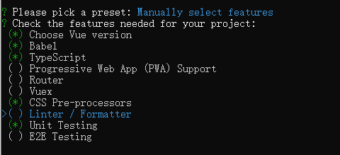
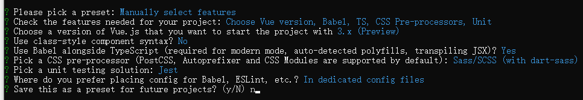

# vue3-jsonschema


## 项目初始化选择






## 项目初始化后
#### tsconfig.json 里面的 
```json
{
    "jsx": "preserve",
}
```
ts是支持编译jsx的，配置成`preserve`意思是: 让ts不要去编译jsx，留给babel去编译

这是因为ts中编译jsx，是完全遵循react语法的，对于vue3.0里面的jsx，我们需要babel插件来处理


## vue-next部分源码解读


### defineComponent函数
代码: [apiDefineComponent.ts](https://github.com/vuejs/vue-next/blob/master/packages/runtime-core/src/apiDefineComponent.ts)

```ts
// 第29行
export type PublicProps = VNodeProps &
  AllowedComponentProps &
  ComponentCustomProps
```
定义了一些公共的Props，比如 `class/style` 