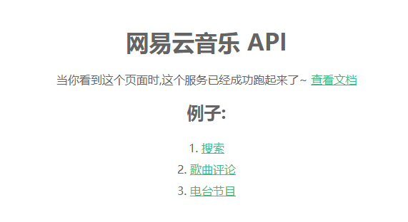

# vue3 写的音乐搜索

## 主要功能介绍


## 运行
- 安装依赖
```shell
# 前端依赖
npm i

# 后端依赖
cd backend
npm i
```

- 运行
```shell
# 前端启服务
npm start

# 后端启服务
npm run serve
```


## 前端


## 后端
后端代码来源于[网易云音乐](https://github.com/Binaryify/NeteaseCloudMusicApi)

通过 `npm serve` 启动服务后访问 `http://localhost:3000/` 看到下面界面



点击 `查看文档` 即可跳到对应界面 `https://binaryify.github.io/NeteaseCloudMusicApi/#/`

比如搜索的接口是 `http://localhost:3000/search?keywords=海阔天空`

然后前端在 `vue.config.js` 做方向代理