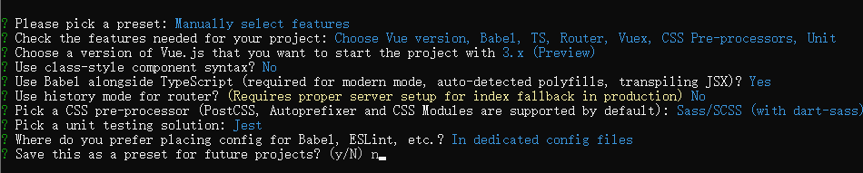
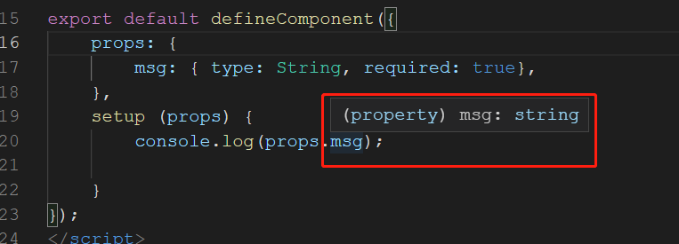
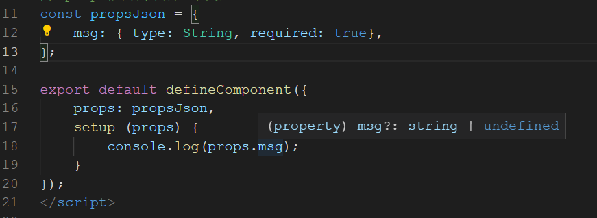
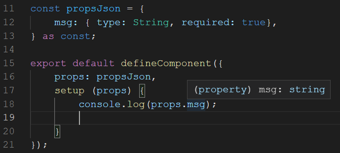

# vue-schema

## 项目选配





## props抽成一个变量

在ts中，我们在props定义了一些属性，并声明为 `required:true` 则ts会认为该prop会一定存在

```vue
// Child.vue
export default defineComponent({
    props: {
        msg: { type: String, required: true},
    },
    setup (props) {
        console.log(props.msg);
        
    }
})
```
用vscode可以看出，`props.msg`是字符串类型，并且必定有值



而在有的时候，我们想把props的定义抽离出去（比如和其他组件的Props定义是一样的，那么就把props抽成一个变量公用）

```vue
// props抽离出来成一个变量
const propsJson = {
    msg: { type: String, required: true},
};

export default defineComponent({
    props: propsJson,
    setup (props) {
        console.log(props.msg);
        
    }
});
```
而一旦我们抽成一个变量，ts就会认为msg有可能没传，但我们明明已经声明了 `required:true`




显然这并不是我们要的，目前解决方法是把这个抽离的变量加上`as const`

```vue
const propsJson = {
    msg: { type: String, required: true},
} as const;
```

这样再用vscode看，就和直接定义在props里面一样，ts认识得  `required:true`



