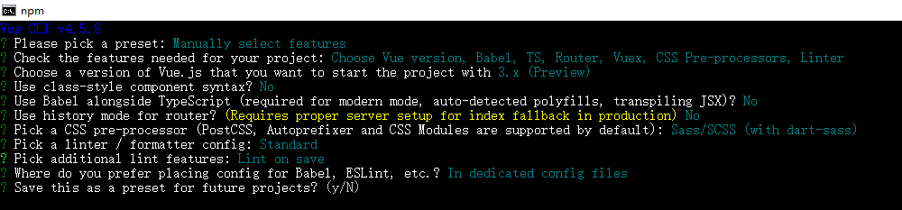

# vue3练手项目

vue3练手项目
- ts
- vue@3: 特别是新特性这一块
- boostrap@4: 构建ui


## 1、vue create选择的选项




## 2、开发过程记录的知识点
### 2.1 props遇到数组类型的时候
代码: `/src/components/ColumnList.vue`

在props遇到数组的时候，需要用 `as PropType<T>` 来告诉ts该props的类型
```js
props: {
    list: Array as PropType<string[]>
}
```
`PropType<T>`的作用是把构造函数断言为类型，这个在`vue@2`中也是存在的

同样也适用在 Object 上，代码: `/src/components/GlobalHeader.vue`
```js
props: {
    user: {
        type: Object as PropType<UserProps>,
        required: true
    }
}
```


### 2.2 refs获取DOM
在vue@3中，refs获取指定DOM有新的方式
```js
// html
<div ref="dropdown">123</div>

// js
setup () {
    const dropdownRef = ref<null | HTMLElement>(null);
    console.log(dropdownRef); // 此刻还是null
    onMounted(() => {
        console.log(dropdownRef.value); // 在挂载后，通过 `xx.value` 可以获取到DOM
    });
    return { dropdown: dropdownRef }; // 把这个return出去的赋值给html中的ref属性，vue会自动去获取
}
```
因为 `setup()` 执行的时候，还没有挂载到DOM。

所以在 `setup()` 函数里面是获取不到DOM的，此刻是null。等到挂载好了，vue会自动赋值给 `dropdownRef` 变量

另外要注意点的是，`ref`和`Ref`是不同的，前者是一个函数，后者是一个类型声明
```js
const dropdownRef: Ref<null | HTMLElement> = ref<null | HTMLElement>(null);
```


### 2.3 表单校验的封装
目的为了类似下面方便的用法
```html
<validate-input :rules=""></validate-input>

interface RuleProp {
    type: 'require' | 'email' | 'range' | ..
    message: string;
}
```
* type: 限定传递进来的只能是 `'require' | 'email' | 'range'` 等等这类字符串
* message: 校验不通过提示的文字

> 对于interface声明，我们可以多用type起别名
```js
// /src/components/ValidateInput.vue
export interface RuleProp {
    type: 'email' | 'required';
    message: string;
}
export type RuleProps = RuleProp[];
```
在封装里面，我们遍历数组就可以知道有哪些规则，然后一个个规则校验，一旦有一个不满足就不继续校验了，这个借助 `Array.every()` 轻松实现

> `Array.every()` 返回一个boolean型，会遍历元素，只要有1个不满足就直接返回false，剩余的不会执行

代码位置: `/src/components/ValidateInput.vue`


### 2.4 vue@3实现v-model
在vue@2中，要实现自定义组件v-model，只需要传入`:value`，组件内`@emit('input')`
```vue

```
而在 `vue@3` 提供了更加灵活的方式
```html
<validate-input v-model="emailRef.value"></validate-input>

// js
props: {
    modelValue: String
},
setup (props, context) {
    context.emit('update:modelValue', targetVal);
}
```


### 2.5 非Prop的Attribute
[vue2中关于非Prop的Attribute介绍](https://cn.vuejs.org/v2/guide/components-props.html)

简单说就是对于自定义组件，我们可以写上任意的attribute，而写的attribute不在组件的props中，就成为非prop的attribute

比如自定义组件 `<custom></custom>`
```html
// js props定义了name这个prop
props {
    name: String
}

// html name在prop声明的范围内，而age不在，所以age就成为非props的attribute
<custom name="xioaming" age="23"></custom>
```
而这些非props的attribute，会默认集成到组件的跟节点上。

如果不想要集成到跟节点上，给组件设置
```js
Vue.component('my-component', {
    inheritAttrs: false, // 不继承
    data () {}
})
```

`$attr`获取的就是上面的非props的attribute

而在 `/src/components/ValidateInput.vue` 上，我们就是用这种方式实现将外界传入的各种非props属性转移到`<input />`标签上


### 2.6 显示emit出去的事件和参数
在 vue@2 中我们随意 `$emit(事件, 参数)` 没有任何约束

在 vue@3 中，我们可以在组件内，对该组件打算emit出去的事件和参数进行限制。通过`emits`属性控制

代码位置: `/src/components/ValidateForm.vue`

```js
emits: {
    formsubmit: (playload: boolean) => {
        console.log(playload);
        return true;
    }
}
```
上面代码，限制了组件内只能 emit 一个 fromsubmit 事件，参数是一个boolea值


### 2.7 $on/$once/$off/$emit 被取消
在vue@3中取消了这几个监听，如果要实现，需要自己去引用第3方库。

vue@3中推荐了一个 `mitt` 的第3方库。安装`npm i -S mitt`，具体用法见[mitt](https://www.npmjs.com/package/mitt)


### 2.8 路由
在 vue@2 中，我们获取路由上的 params/query 参数是通过 `this.$route` 获取的

在 vue@3 中，不能用上面的方式获取了，vue-router提供了对应的hooks函数

代码: `/src/views/ColumnDetail.vue`
```js
import { useRoute } from 'vue-router';

setup () {
    const route = useRoute();
    console.log(route.query, route.params); // 获取
}
```

代码: `/src/views/Home.vue`
```js
import { useRouter } from 'vue-router';
setup () {
    const router = useRouter();
    router.push({ name: 'columnDetail', params: { id: 1 }, query: { name: 'xiaoming' } });
}
```


### 2.9 vuex
和 vue-router 一样，vuex也是改了

代码: `/src/views/Home.vue`

因为在getters中不支持外界传递参数进来，我们可以在getters返回一个函数，函数接收外界的数据
```js
getters: {
    // 根据id获取栏目详情，id为外界传递进来的数据
    getColumnById: (state) => {
        return (id: number) => {
            return state.columns.find(column => column.id === id);
        };
    }
    // 上面可以简写
    getColumnById: (state) => (id: number) => state.columns.find(column => column.id === id)
},
```


### 2.9 loading.vue
代码位置: `/src/components/Loading.vue`

因Loading.vue组件内是使用瞬移组件，渲染到`id=back`的dom上，我们不能每次都让人去修改`/public/index.html`里面的。所以在Loading.vue里面自动创建这样的DOM，然后Loading.vue销毁的时候移除这个dom

这个功能在很多组件需要用到，可以封装为一个hooks函数

代码: `/src/hooks/useDOMCreate.ts`

```js
import { onUnmounted } from 'vue';
function useDOMCreate (id: string) {
    const node = document.createElement('div');
    node.id = id;
    document.body.appendChild(node);
    onUnmounted(() => {
        document.body.removeChild(node);
    });
}
export default useDOMCreate;
```


### 2.9 Message.vue
Message.vue演示了怎么将一个组件封装为一个函数组件，这样在页面上就可以通过函数调用直接展示这个组件了

代码位置: `/src/components/createMessage.ts`

封装的原理：
- 使用`createapp(vueComponents, props)` 该函数接收2个参数，第1个参数是vue组件对象，第2个参数是传递给该组件对象的props属性
```html
const messageInstance = createApp(Message, {
    message: 'this is message',
    type: 'sucess'
});
// 相当于下面
<message :message="'this is message'" :type="'sucess'"></message>
```

- 接着创建一个DOM做为容器，然后把上面的messageInstance挂载上去
```js
const mountNode = document.createElement('div');
document.body.appendChild(mountNode);
messageInstance.mount(mountNode);
```