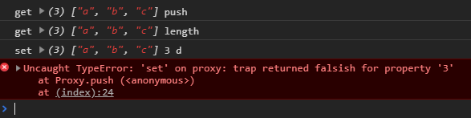

# 模拟vue3几个响应api的实现

vue3的几个api: `shallowReactive/shallowRef/reactive/ref/shallowReadonly`

## 1、资料来源
1. [v3响应数据本质【上】](https://www.bilibili.com/video/BV14k4y117LL?p=27)
2. [v3响应数据本质【下】](https://www.bilibili.com/video/BV14k4y117LL?p=28)
3. [手写shallowReactive和shallowRef](https://www.bilibili.com/video/BV14k4y117LL?p=29)
4. [手写reactive和ref](https://www.bilibili.com/video/BV14k4y117LL?p=30)
5. [手写shallowReadonly](https://www.bilibili.com/video/BV14k4y117LL?p=31)

## 2、Proxy的用法
Proxy可以在对象外层加一层拦截，但获取/设置对象值的时候，先经过这层拦截
```js
const person = {name:'小明',age:12};
const state = new Proxy(person, {
    get (obj, key) {
        console.log('get', obj, key);
        return obj[key];
    },
    set (obj, key, newVal) {
        console.log('set', obj, key, newVal);
        obj[key] = newVal;
        // vue在这里去更新html
    }
});
state.name = '小红'; // 触发set钩子
console.log(state.name); // 触发get钩子

// proxy的好处，如果属性原先没有的也会触发钩子
state.sex = '女'; // 触发set钩子
```

除了JSON，对于数组一样适用
```js
const arr = ['a', 'b', 'c'];
const state = new Proxy(arr, {
    get (obj, key) {
        console.log('get', obj, key);
        return obj[key];
    },
    set (obj, key, newVal) {
        console.log('set', obj, key, newVal);
        obj[key] = newVal;
    }
});
state.push('d'); // 往数组添加一个元素
```
然而上面的会报错，错误信息:`Uncaught TypeError: 'set' on proxy: trap returned falsish for property '3'`



我们来解析下控制台这些信息，对于`state.push('d')`这句话，做了哪些动作:
1. 获取state上的`push()`方法，这也就是为什么第1句是触发get钩子，`key=push`
2. `push()`是往数组最后添加一个元素，所以需要知道数组的长度，获取数组的length属性，又触发了get钩子，`key=length`
3. 接着`push()`往数组最后位置添加，就触发了set钩子
4. 正常来说，等到最后位置添加好后，应该去修改数组的length，使其+1。

但是上面代码执行完第3步就停止了，是因为我们并没有在set中`return true`。有这个return，js才知道第3不完成了，才会继续走。

所以代码改为:
```js
set (obj, key, newVal) {
    console.log('set', obj, key, newVal);
    obj[key] = newVal;
    return true; // 加上这一句即可
}
```


**Proxy只会拦截第1层**

```js
const obj = {
    name: 'xiaoming',
    a: {
        b: { 
            c: 1 
        }
    }
};
const state = new Proxy(obj, {
    get (obj, key) {
        console.log('get', key);
        return obj[key];
    },
    set (obj, key, newVal) {
        console.log('set', key);
        obj[key] = newVal;
        return true;
    }
});
state.name = '小红'; // 触发1次set
state.a.b.c = 1;    // 触发1次get，因为有`state.a`
state.a.b = 3;      // 触发1次get，因为有`state.a`
```
从上面可以看出，只有对第1层属性设置/获取的时候，才会触发get/set


## 3、 封装一个shallowReactive和shallowRef

从上面Proxy的特性，就不难封装一个`shallowReactive/shallowRef`了

我们知道shallowReactive只监听第1层，这个和proxy完全一样。

而shallowRef只监听`.value`层，我们将其传入的参数A，再包装一层即可`{value:参数A}`
```js
// 封装一个shallowReactive
function shallowReactive (obj) {
    return new Proxy(obj, {
        get (obj, key) {
            console.log('get', key);
            return obj[key];
        },
        set (obj, key, newVal) {
            console.log('set', key);
            obj[key] = newVal;
            console.log('更新html');// vue在这里更新html
            return true;
        }
    });
}
const state = shallowReactive({
    name: '小明',
    a: {
        b: {
            c: 1
        }
    }
});
state.name = '小红'; // 触发set
state.a.b.c = 3; // 不会触发set,就不会html更新
state.a.b = 4; // 不会触发set,就不会html更新


// 封装一个shallowRef
function shallowRef (value) {
    return shallowReactive({value});
}
const state2 = shallowRef({
    name: '小明',
    a: {
        b: {
            c: 1
        }
    }
});
state2.value.a = 11; // 不会触发set，所以不会更新html
state2.value = 1; // 触发set，所以更新html
```


## 4、 封装一个reactive和ref
`reactive/ref`和`shallowReactive/shallowRef`的区别是每一层都监听，那么我们只要变量下对象的属性，判断该属性的value是否为一个对象，是的话就将其再封装成一个proxy。

说白了这是一个递归调用，结束添加是对象value不是一个对象

要考虑数组和json格式2种

```js
// 封装一个reactive
function reactive(obj) {
    if (typeof obj !== 'object') {
        console.log('传递进来的不是一个object类型');
        return false;
    }
    // obj是一个数组，那么就遍历数组，看每个原始是否为对象
    // 比如 obj=[{name:'小明'}, {name:'小红'}] 这种情况
    if (Array.isArray(obj)) {
        obj.forEach((item, index) => {
            if (typeof item === 'object') {
                obj[index] = reactive(item); // 重新赋值给原来的位置
            }
        });
    } else {
        // obj是一个JSON对象的情况，就需要看每个属性的value是否为一个对象
        for (const [key, value] of Object.entries(obj)) {
            if (typeof value === 'object') {
                obj[key] = reactive(value);
            }
        }
    }
    return shallowReactive(obj);
}

const state3 = reactive([{name:'小明'}, {a: {b: {c: 1}}}]);
state3[0].name = '小红'; // 触发set，更新html
state3[1].a.b.c = 1; // 触发set，更新html

const state4 = reactive({a: {b: {c:1}}});
state4.a.b.c = 12; // 触发set，更新html
```

对于封装`ref()`就更简单了，基于`reactive()`包装一层`.value`即可
```js
function ref (value) {
    return reactive({value});
}
const state5 = ref({a: {b: {c: 1}}});
state5.value.a.b.c = 12;
```


## 5、封装一个shallowReadonly和readonly
我们知道`shallowReadonly()`是控制第1层属性只读，那么我们只要把Proxy的`set()`中设置值的代码去掉即可
```js
function shallowReadonly(obj) {
    return new Proxy(obj, {
        get (obj, key) {
            console.log('get', key);
            return obj[key];
        },
        set (obj, key, newVal) {
            console.log('set', key);
            // 去掉这2句并给下warn警告
            // obj[key] = newVal; 
            // console.log('更新html');
            console.warn(`${key}属性为只读`);
            return true;
        }
    });
}
const state6 = shallowReadonly({a: {b: {c:1}}});
state6.a = 12;// 异常，只读
state6.a.b.c = 111; // js会变，html不会更新
```

如果是`reactive+shallowReadony`一起使用也是和vue一样的效果
```js
const state7 = reactive({a: {b: {c:1}}});
const state8 = shallowReadonly(state7);
state8.a = 12;// 异常，只读
state8.a.b.c = 111; // js会变，html也会更新
```

而`readonly()`其实也是类似，去递归对象的value，每一层都加`shallowReadonly()`
